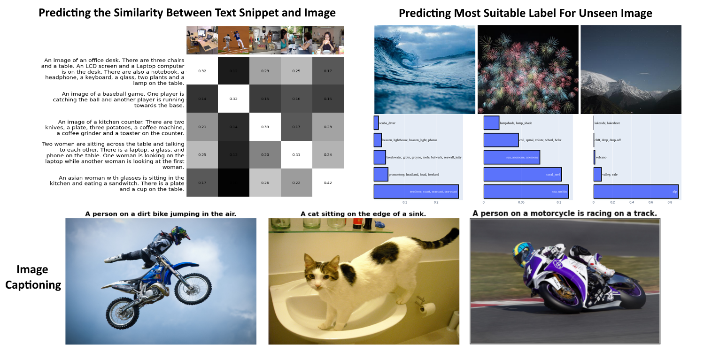

# Denoising Diffusion Model


A tutorial on vision transformers with example applications.





## Requirements

Run the following for installation of requirements:

```
pip install -r requirements.txt

```


## The tutorial 📃
The full tutorial is available on medium.

https://azad-wolf.medium.com/


## References 

[1] Alexey Dosovitskiy, Lucas Beyer, Alexander Kolesnikov, Dirk Weissenborn, Xiaohua Zhai, Thomas Unterthiner, Mostafa Dehghani, Matthias Minderer, Georg Heigold, Sylvain Gelly, Jakob Uszkoreit, Neil Houlsby, "An Image is Worth 16x16 Words: Transformers for Image Recognition at Scale", ICLR, 2021

[2] Alexey et al, Vision Transformers, https://github.com/google-research/vision_transformer, 2020

[3] Saahil et al, CaTr: Image Captioning with Transformers, https://github.com/saahiluppal/catr, 2020


